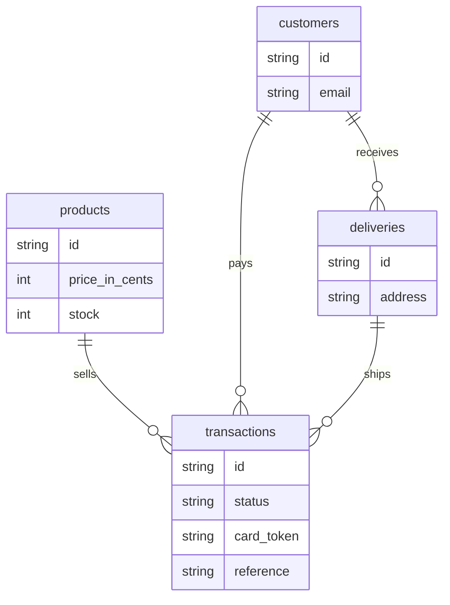

# Checkout API

Sinatra API for the storefront. Use cases return a `Result` and do not raise for an expected failure. ActiveRecord is only the PostgreSQL adapter.

```
app/domain          entities and the Result type
app/application     use cases
app/adapters/http   Sinatra routes
app/adapters/persistence
app/adapters/gateways
```



The database stores the gateway token. It has no column for the card number or the CVV. Only the gateway adapter calls the sandbox, with the private key.

## Requirements

- Ruby 3.4.7 (`mise` reads `api/.ruby-version`)
- PostgreSQL 18 running locally
- Bundler

## Run locally

```bash
cd api
cp .env.example .env
bundle install
bundle exec rake db:create db:seed
bundle exec rackup -p 4567
```

`db:seed` inserts the four studio pieces the storefront already shows. Seeding again does not reset stock.

Put the sandbox public key, private key, and integrity secret in `.env`. Leave `GATEWAY_MODE=sandbox`. If the private key is empty, the API uses a local fake gateway: `tok_declined` is declined and any other token is approved.

The storefront talks to this API when `VITE_USE_MOCKS=false` and `VITE_API_BASE_URL=http://localhost:4567`.

## Contract

Amounts are integer cents. Currency is `COP`. JSON is camelCase.

| Method | Path | Result |
| :--- | :--- | :--- |
| `GET` | `/api/products` | Catalog |
| `GET` | `/api/products/:id` | One product |
| `POST` | `/api/checkout/quote` | Product amount + base fee + shipping, plus a 10-minute `checkoutToken` |
| `POST` | `/api/transactions` | `201` when the `Authorization: Bearer` checkout token matches the product and total |
| `GET` | `/api/transactions/:id` | Refreshes a pending payment and returns stock once it settles |

Open [http://localhost:4567/docs](http://localhost:4567/docs) while the API is running. That page is Swagger UI for [`openapi.yaml`](openapi.yaml).

A quote adds a base fee of 150000 cents and shipping of 900000 cents. The quote also returns `checkoutToken`, signed with `CHECKOUT_TOKEN_SECRET`. That secret stays in the API environment. Stock decreases once, and only when a payment becomes `APPROVED`.

## Tests

RSpec and SimpleCov. Jest does not instrument Ruby, so this module reports coverage from SimpleCov.

```bash
bundle exec rspec
```

| Metric | Result |
| :--- | :--- |
| Lines | 100.00% (383 / 383) |
| Branches | 93.26% (83 / 89) |

22 examples pass. The report is written to `api/coverage`.
